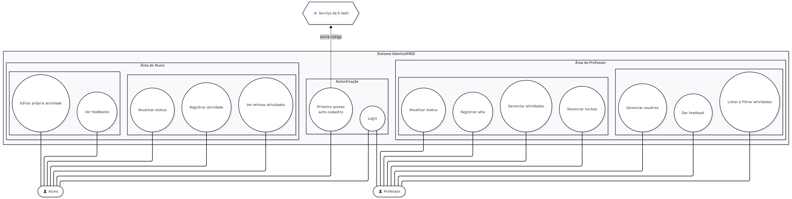

# Casos de uso

## Regras de fronteira

- O **aluno** só enxerga e altera as **próprias** atividades; a turma da atividade é inferida
  da sua matrícula ativa.
- **Registrar alta** é exclusivo do **professor** e só é permitido sobre atividades em status
  `CONCLUIDA`. Uma atividade em `ALTA` é terminal — seu status não pode mais ser alterado.
- O cadastro via **primeiro acesso** cria apenas usuários com papel `ALUNO`.
- **Matrícula** só é permitida em turmas **abertas** (`active = true`); turmas de semestres
  encerrados não aceitam novas matrículas.