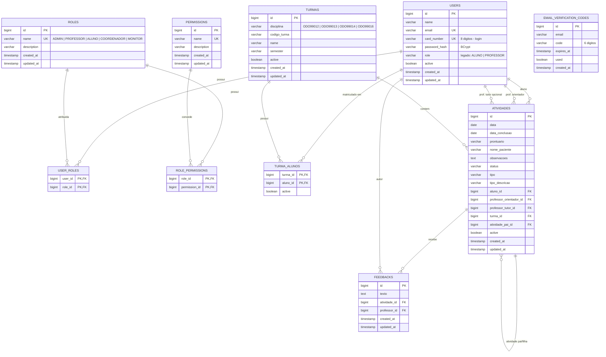

# DER - Modelo De Dados

## Observacoes De Modelagem

- `USERS.role` permanece como campo legado para compatibilidade, mas a autorizacao nova e feita
  por `roles`, `permissions`, `user_roles` e `role_permissions`.
- As permissions cadastradas no banco devem corresponder ao enum `PermissionName` do backend.
- `USER_ROLES` permite atribuir mais de uma role ao mesmo usuario futuramente.
- `ROLE_PERMISSIONS` permite alterar o conjunto de permissoes por role via migration ou seed.
- `TURMA_ALUNOS` tem PK composta `(turma_id, aluno_id)`. A flag `active` preserva historico de
  matriculas.
- Exclusoes de `ATIVIDADES` e `TURMAS` sao logicas (`active = false`).
- `EMAIL_VERIFICATION_CODES` nao tem FK para `USERS` porque o codigo e gerado antes da conta
  existir.

## Roles E Permissions Iniciais

Roles iniciais:

- `ADMIN`
- `PROFESSOR`
- `ALUNO`
- `COORDENADOR`
- `MONITOR`

Permissions iniciais:

- `USER_MANAGE`
- `USER_VIEW`
- `PROFESSOR_VIEW`
- `STUDENT_VIEW`
- `CLASS_MANAGE`
- `CLASS_VIEW`
- `ACTIVITY_CREATE`
- `ACTIVITY_UPDATE_OWN`
- `ACTIVITY_UPDATE_ANY`
- `ACTIVITY_VIEW_OWN`
- `ACTIVITY_VIEW_ANY`
- `ACTIVITY_REVIEW`
- `FEEDBACK_CREATE`
- `FEEDBACK_VIEW_OWN`
- `FEEDBACK_VIEW_ANY`

## Migrations Liquibase

O schema e versionado em `backend/src/main/resources/db/changelog/migrations/`.

| Arquivo | Conteudo |
| --- | --- |
| `db.changelog-1.0.0.sql` | `users`, `turmas`, `turma_alunos` e indices iniciais |
| `db.changelog-1.1.0.sql` | `atividades`, indices e coluna `active` |
| `db.changelog-1.2.0.sql` | `feedbacks`; remove `feedback_privado` de `atividades` |
| `db.changelog-1.3.0.sql` | colunas `tipo` e `tipo_descricao` em `atividades` |
| `db.changelog-1.4.0.sql` | `email_verification_codes` |
| `db.changelog-1.5.0.sql` | coluna `active` em `turma_alunos` |
| `db.changelog-1.6.0.sql` | normalizacao de `card_number` para 8 digitos |
| `db.changelog-1.7.0.sql` | codigo de turma e disciplinas clinicas padronizadas |
| `db.changelog-1.8.0.sql` | RBAC: `roles`, `permissions`, `user_roles`, `role_permissions` |

Toda mudanca de modelo exige uma migration nova. O Hibernate roda em `ddl-auto: validate`.
