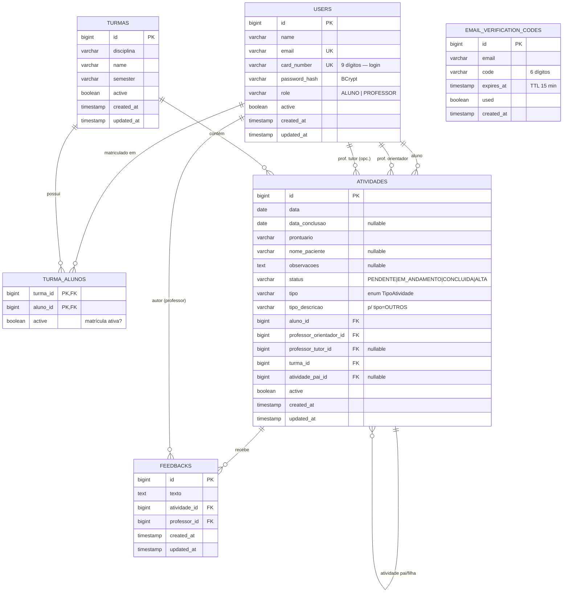

# DER — Modelo de dados

> `EMAIL_VERIFICATION_CODES` não tem FK para `USERS` por design: o código é gerado **antes** de
> a conta existir (fluxo de primeiro acesso), usando o e-mail como chave lógica.

## Observações de modelagem

- `TURMA_ALUNOS` tem PK composta `(turma_id, aluno_id)` → cada par aluno/turma existe no máximo
  uma vez. A flag `active` representa o histórico de matrícula (um aluno migra de uma turma a
  outra ao longo dos semestres; só uma matrícula fica ativa por vez).
- Exclusões de `ATIVIDADES` e `TURMAS` são **lógicas** (`active = false`), não físicas.
- Campos de auditoria (`created_at`, `updated_at`, `created_by`, `last_modified_by`) vêm da
  superclasse `Auditable` (JPA Auditing).

## Migrations (Liquibase)

O schema é versionado em `backend/src/main/resources/db/changelog/migrations/`:

| Arquivo                    | Conteúdo                                                        |
|----------------------------|----------------------------------------------------------------|
| `db.changelog-1.0.0.sql`   | `users`, `turmas`, `turma_alunos` + índices                    |
| `db.changelog-1.1.0.sql`   | `atividades` + índices + coluna `active`                        |
| `db.changelog-1.2.0.sql`   | `feedbacks`; remove `feedback_privado` de `atividades`          |
| `db.changelog-1.3.0.sql`   | colunas `tipo` e `tipo_descricao` em `atividades`              |
| `db.changelog-1.4.0.sql`   | `email_verification_codes`                                      |
| `db.changelog-1.5.0.sql`   | coluna `active` em `turma_alunos`                              |

Toda mudança de modelo exige uma migration nova (o Hibernate roda em `ddl-auto: validate`).