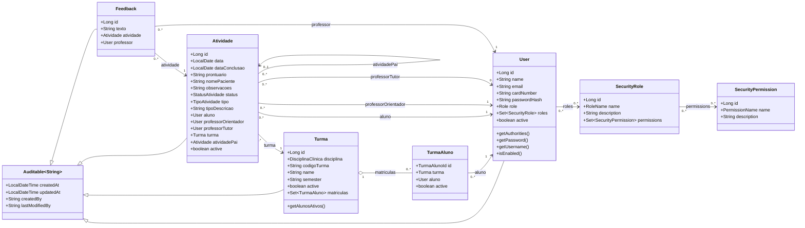
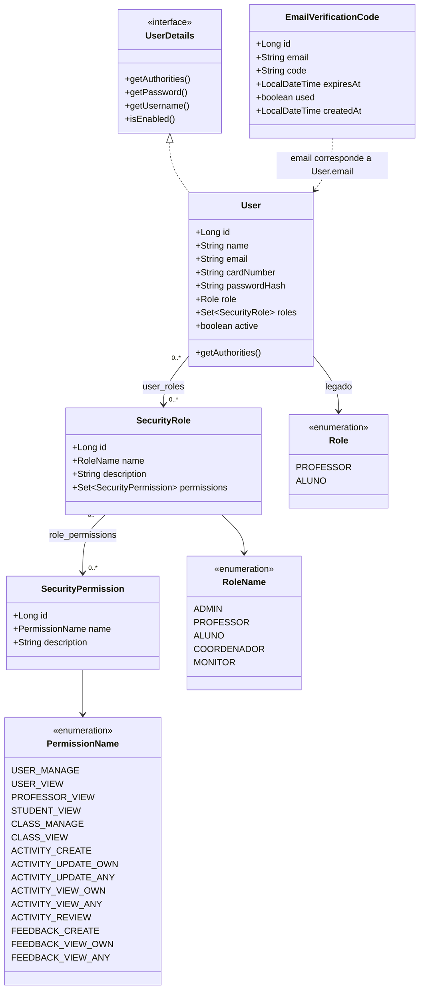
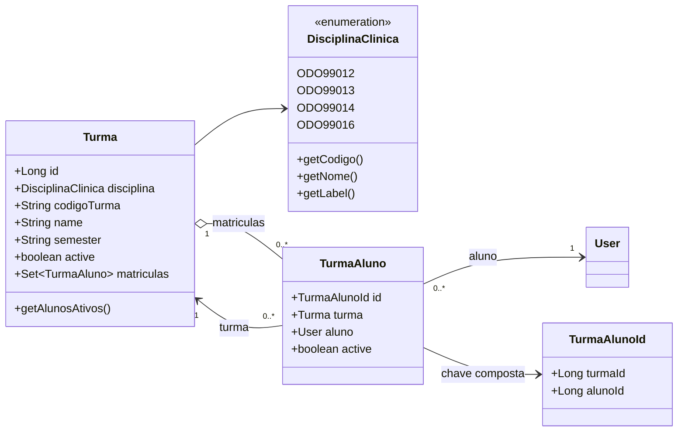
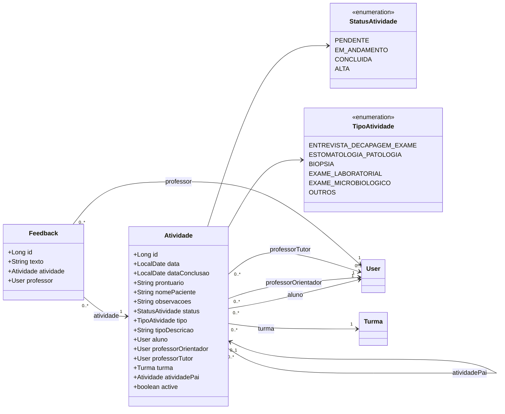

# Diagramas De Classe Do Backend

Este documento representa o estado atual do backend Spring Boot, com base nas entidades JPA
implementadas em `backend/src/main/java/br/ufrgs/odonto/modules`.

Escopo atual:

- `core`: usuarios, autenticacao, verificacao por e-mail e RBAC;
- `turma`: turmas, disciplinas clinicas e matriculas;
- `atividade`: atividades clinicas e feedbacks.

## Visao Geral Do Dominio

## Core, Autenticacao E RBAC

Regras relevantes:

- Login usa `cardNumber` como identificador (`getUsername()` retorna o numero de cartao).
- `User.role` permanece para compatibilidade com fluxos legados.
- `User.roles.permissions` gera as authorities usadas por `@PreAuthorize`.
- Resources novos devem preferir `hasAuthority(...)` em vez de `hasRole(...)`.
- `EmailVerificationCode` guarda codigos de primeiro acesso por e-mail sem FK para `User`.

## Turmas E Matriculas

## Atividades E Feedbacks

## Observacoes Para Evolucao

O modelo atual pressupoe que uma `Atividade` ja possui aluno executante e turma definidos. Se o
fluxo da clinica exigir agendamentos ou demandas ainda sem aluno atribuido, recomenda-se criar
uma entidade anterior, como `DemandaClinica` ou `EncaminhamentoClinico`, em vez de tornar
`Atividade.aluno` opcional sem revisar as regras atuais.
