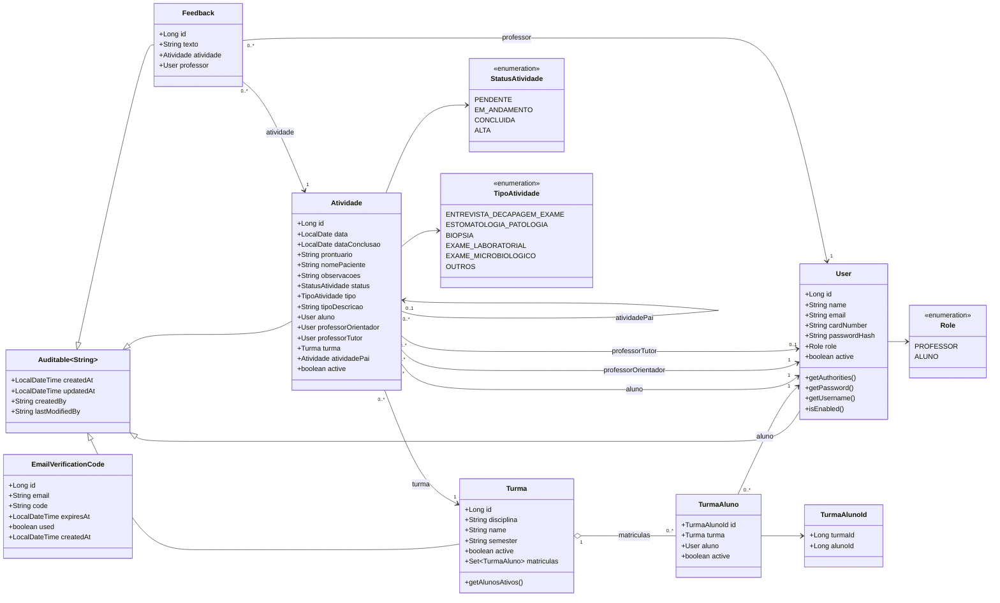
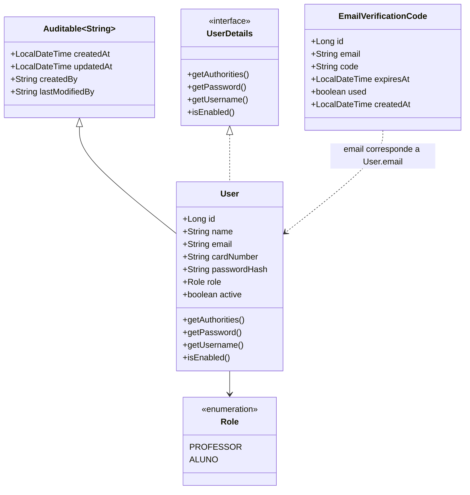
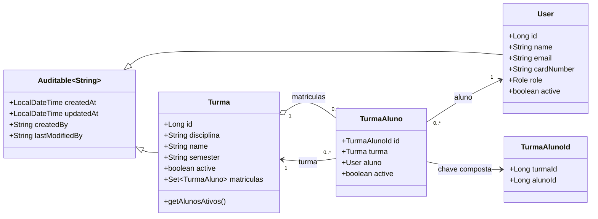
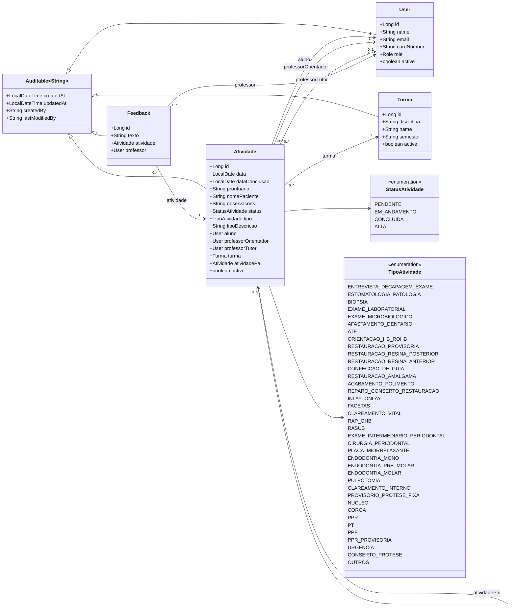

# Diagramas de classe do backend

Este documento representa o estado atual do backend Spring Boot, com base nas entidades JPA
implementadas em `backend/src/main/java/br/ufrgs/odonto/modules`.

Escopo atual:

- `core`: usuarios e codigos de verificacao por e-mail;
- `turma`: turmas e matriculas;
- `atividade`: atividades clinicas e feedbacks.

Os modulos futuros de agendamento, anexos, exames e demandas clinicas ainda nao existem no
backend atual e, portanto, nao aparecem nestes diagramas.

## Visao geral do dominio

Observacoes:

- `Auditable<String>` e uma superclasse mapeada, nao uma tabela propria.
- `User` tambem implementa `UserDetails`, usado pelo Spring Security.
- `EmailVerificationCode` guarda codigos de primeiro acesso por e-mail, mas nao possui chave
  estrangeira para `User`; a associacao e feita pelo campo `email`.
- `TipoAtividade` possui mais valores no codigo do que os exibidos no diagrama geral. A lista
  completa aparece mais abaixo.

## Core e autenticacao

Regras relevantes:

- Login usa `cardNumber` como identificador (`getUsername()` retorna o numero de cartao).
- `role` define autorizacao por perfil (`PROFESSOR` ou `ALUNO`).
- `active` controla se a conta esta habilitada.
- O fluxo de primeiro acesso usa `EmailVerificationCode` com validade e flag `used`.

## Turmas e matriculas

Regras relevantes:

- `TurmaAluno` e a entidade de associacao entre turma e aluno.
- A chave composta `TurmaAlunoId` contem `turmaId` e `alunoId`.
- A flag `active` em `TurmaAluno` permite manter historico e desativar matriculas antigas.
- O backend trata a regra de que um aluno deve possuir no maximo uma matricula ativa.
- `Turma.active = false` representa turma encerrada.

## Atividades e feedbacks

Regras relevantes:

- `Atividade.aluno`, `Atividade.professorOrientador` e `Atividade.turma` sao obrigatorios.
- `Atividade.professorTutor` e opcional.
- `Atividade.atividadePai` permite representar atividades-filhas.
- `Feedback` sempre pertence a uma atividade e a um professor.
- O status `ALTA` representa encerramento e, conforme regra atual, deve ser irreversivel.

## Observacoes para evolucao

O modelo atual pressupoe que uma `Atividade` ja possui aluno executante e turma definidos.
Se o fluxo da clinica exigir agendamentos ou demandas ainda sem aluno atribuido, recomenda-se
criar uma entidade anterior, como `DemandaClinica` ou `EncaminhamentoClinico`, em vez de tornar
`Atividade.aluno` opcional sem revisar as regras atuais.

Essa entidade futura poderia ser criada por um sistema de agendamento e, posteriormente,
convertida em `Atividade` quando aluno, turma e professores forem definidos.
