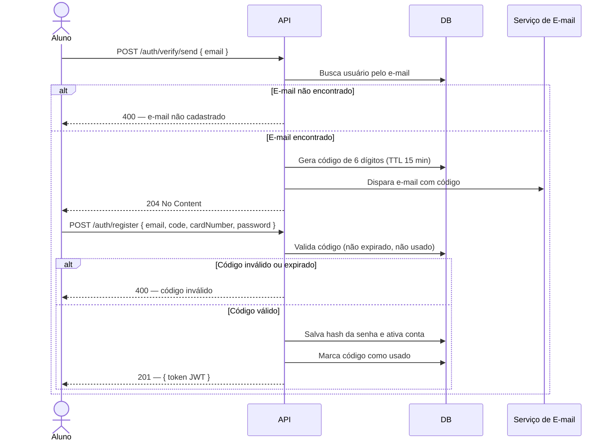
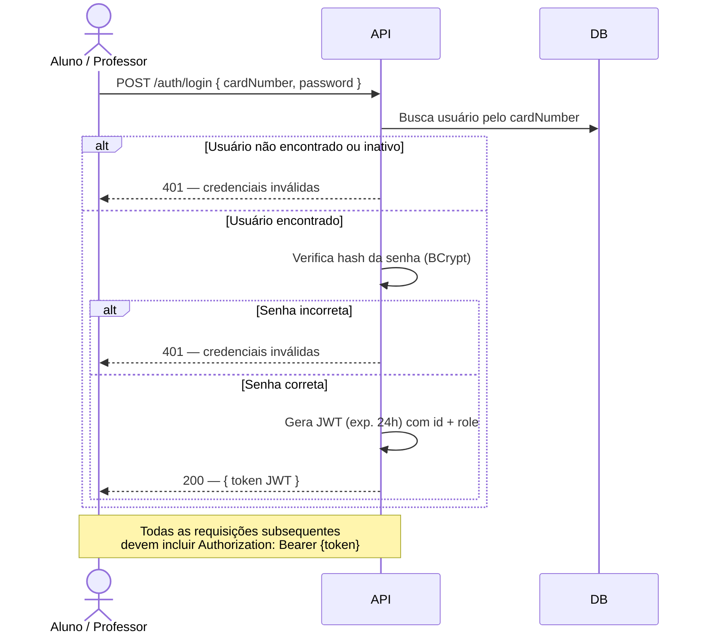
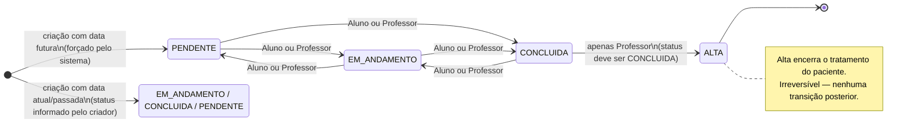
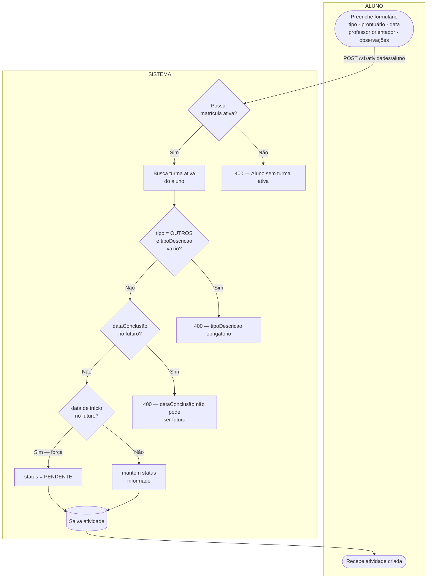
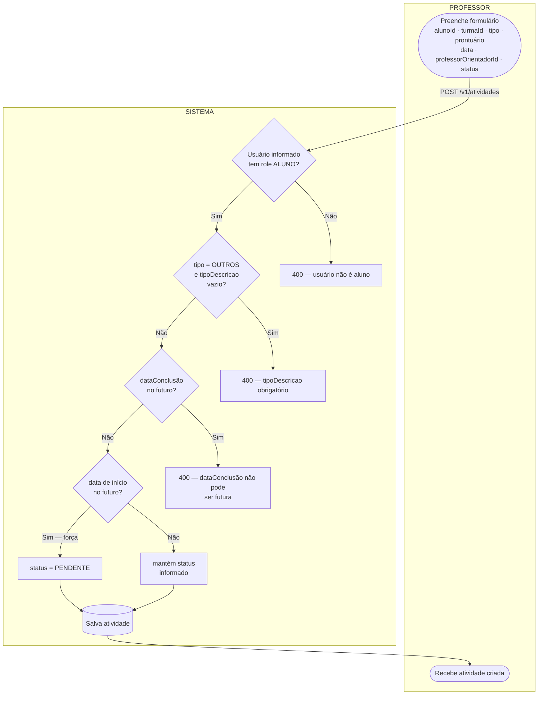
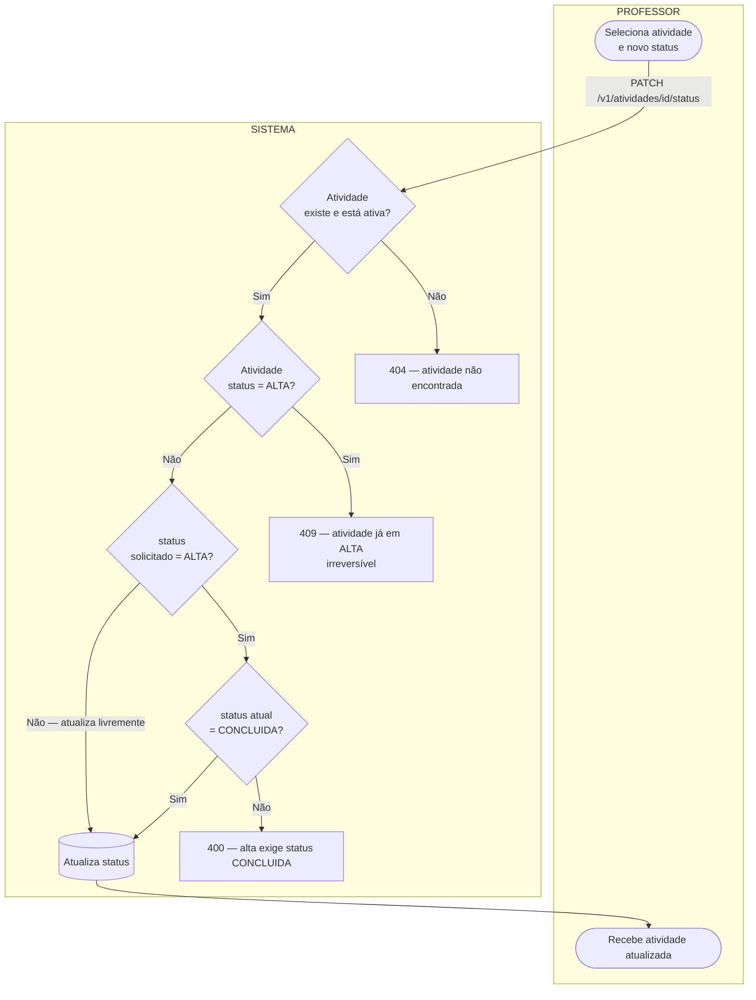
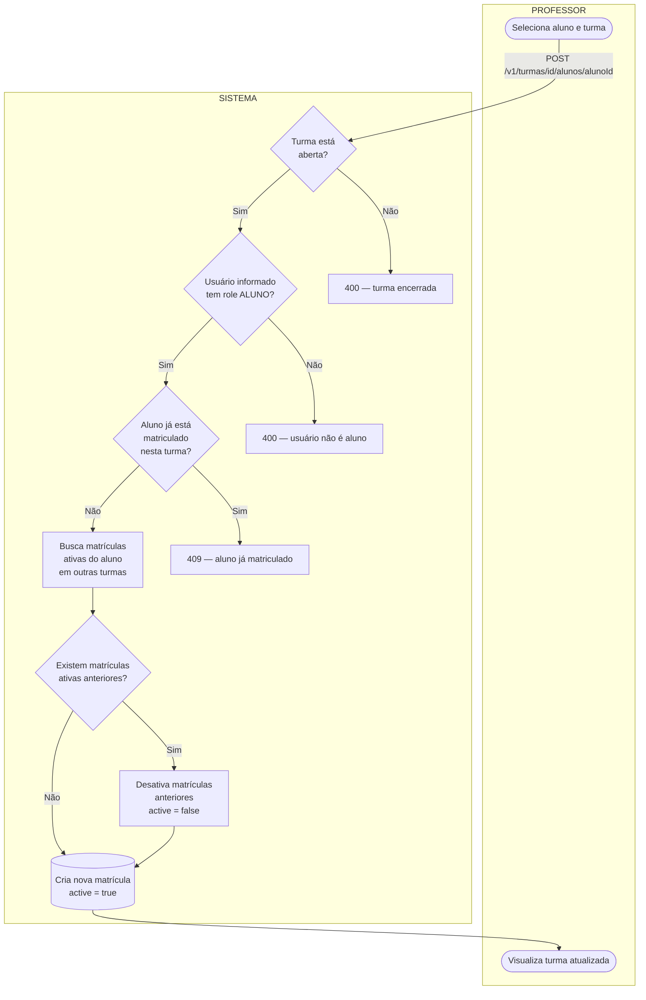
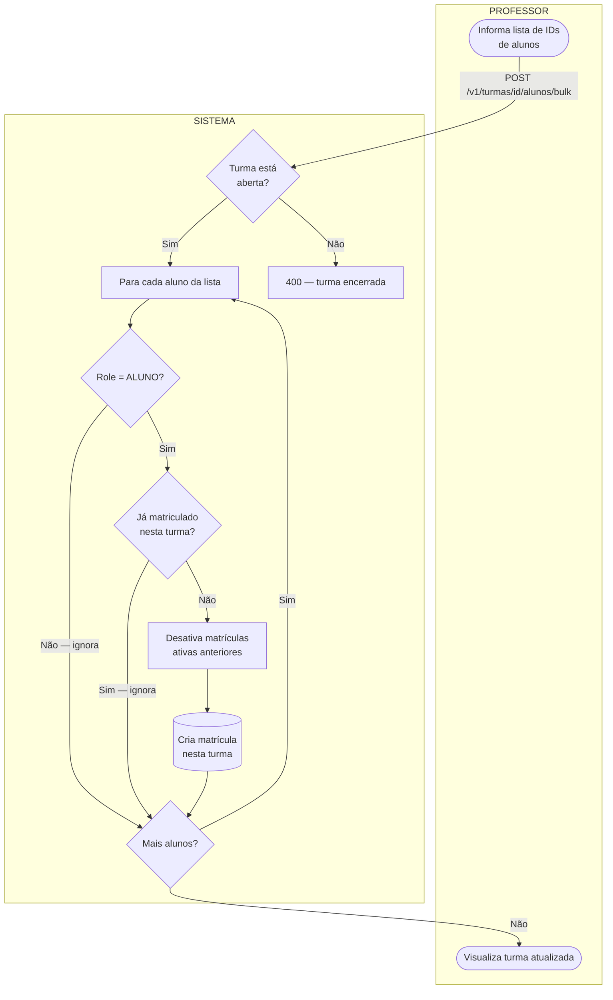

# Fluxos Principais — OdontoUFRGS

---

## 1. Primeiro Acesso (Cadastro de Aluno)

---

## 2. Autenticação

---

## 3. Ciclo de Vida do Status de uma Atividade

---

## 4. Criação de Atividade pelo Aluno

---

## 5. Criação de Atividade pelo Professor

---

## 6. Atualização de Status pelo Professor (Alta do Paciente)

---

> **Regras de matrícula (seções 7 e 8).** Cada turma é específica de um semestre (turmas de
> semestres diferentes têm `id` diferente). Não se matricula em turma **encerrada**
> (`active = false`): para o semestre seguinte cria-se uma turma nova. Um aluno tem no máximo
> **uma matrícula ativa** por vez — ao entrar numa turma nova, as matrículas ativas anteriores
> são desativadas. A checagem de "já matriculado" considera apenas matrículas **ativas**; se o
> aluno já esteve nesta (mesma) turma aberta, a matrícula é **reativada** em vez de duplicada.

## 7. Matrícula de Aluno em Turma

---

## 8. Matrícula em Lote (Bulk)

> **Nota sobre status HTTP.** Os fluxogramas indicam `400` para validações por consistência
> conceitual, mas a implementação atual responde **`409 Conflict`** para `BusinessException`
> (ver item 13 em [bugs-e-backlog.md](../bugs-e-backlog.md)).
