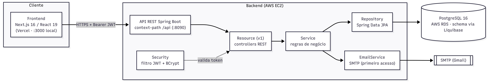

# Arquitetura — Visão geral

## Componentes

- **API stateless:** autenticação por **JWT** (sem sessão). O `JwtAuthenticationFilter` valida
  o token e injeta o `User` autenticado no contexto de segurança.
- **Autorização por papel** via `@PreAuthorize("hasRole('PROFESSOR'|'ALUNO')")` nos resources.
- **Mapeamento entidade↔DTO** com MapStruct; **schema** gerido por Liquibase e apenas
  *validado* pelo Hibernate (`ddl-auto: validate`).
- **Organização por módulos de domínio:** `core` (usuários/auth), `turma`, `atividade`.

## Stack

| Camada      | Tecnologias                                                                 |
|-------------|----------------------------------------------------------------------------|
| Frontend    | Next.js 16 (App Router), React 19, TypeScript, Tailwind CSS, Radix UI       |
| Backend     | Java 21, Spring Boot 3.4 (Web, Security, Data JPA, Validation, Mail), JWT (jjwt), MapStruct, Lombok |
| Banco       | PostgreSQL 16, migrations com Liquibase                                     |
| Build/Infra | Maven (wrapper), Docker, Terraform, AWS, GitHub Actions                     |
| Docs API    | springdoc-openapi (Swagger UI em `/api/swagger-ui.html`)                    |

## Modelo de domínio (resumo)

- **User** — aluno ou professor (`role`). Login por número de cartão (9 dígitos) + senha
  (BCrypt). O `cardNumber` é a identidade canônica.
- **Turma** — disciplina + semestre. Cada turma é específica de um semestre (turmas de
  semestres diferentes têm `id` distinto). Alunos são matriculados via **TurmaAluno**
  (matrícula com flag `active`); um aluno tem no máximo **uma matrícula ativa** por vez.
- **Atividade** — procedimento clínico de um aluno, vinculado a uma turma, um professor
  orientador (e opcionalmente um tutor). Tem `tipo` (enum de ~40 procedimentos), `status`
  (`PENDENTE` → `EM_ANDAMENTO` → `CONCLUIDA` → `ALTA`) e pode ter atividades-filhas
  (`atividadePai`).
- **Feedback** — comentários de professores numa atividade.

Detalhes em [DER](der.md), [casos de uso](casos-de-uso.md) e [fluxos](fluxos.md).

## Principais endpoints

Base: `/api`. Documentação interativa: `/api/swagger-ui.html`.

| Método | Caminho                              | Papel     | Descrição                            |
|--------|--------------------------------------|-----------|--------------------------------------|
| POST   | `/auth/login`                        | público   | Login (cardNumber + senha)           |
| POST   | `/auth/verify/send`                  | público   | Envia código de primeiro acesso      |
| POST   | `/auth/register`                     | público   | Conclui primeiro acesso (cria aluno) |
| GET    | `/v1/atividades`                     | PROFESSOR | Lista/filtra atividades              |
| POST   | `/v1/atividades`                     | PROFESSOR | Cria atividade                       |
| GET    | `/v1/atividades/minhas`              | ALUNO     | Lista as próprias atividades         |
| POST   | `/v1/atividades/aluno`               | ALUNO     | Cria atividade (turma inferida)      |
| PATCH  | `/v1/atividades/{id}/status`         | AMBOS     | Atualiza status (alta só professor)  |
| POST   | `/v1/turmas/{id}/alunos/{alunoId}`   | PROFESSOR | Matricula um aluno                   |
| POST   | `/v1/turmas/{id}/alunos/bulk`        | PROFESSOR | Matricula vários alunos              |
| POST   | `/v1/atividades/{id}/feedbacks`      | PROFESSOR | Adiciona feedback                    |