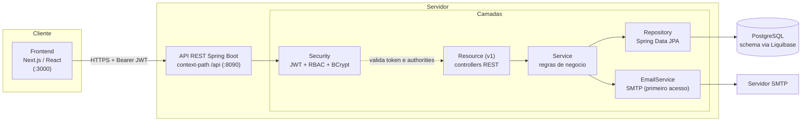

# Arquitetura - Visao Geral

## Componentes

- **API stateless:** autenticacao por JWT, sem sessao. O `JwtAuthenticationFilter` valida o
  token e injeta o `User` autenticado no contexto de seguranca.
- **Autorizacao por RBAC:** o usuario ainda mantem o campo legado `role`, mas agora tambem
  carrega `roles` e `permissions` persistidas no banco. Os resources usam `@PreAuthorize` com
  `hasAuthority(...)` e `hasAnyAuthority(...)`.
- **Mapeamento entidade-DTO:** MapStruct.
- **Schema:** gerido por Liquibase e apenas validado pelo Hibernate (`ddl-auto: validate`).
- **Organizacao por modulos de dominio:** `core` (usuarios/auth/seguranca), `turma` e
  `atividade`.

## Stack

| Camada | Tecnologias |
| --- | --- |
| Frontend | Next.js, React, TypeScript, Tailwind CSS, Radix UI |
| Backend | Java 21, Spring Boot, Spring Security, Data JPA, Validation, Mail, JWT, MapStruct, Lombok |
| Banco | PostgreSQL, migrations com Liquibase |
| Build/Infra | Maven wrapper, Docker, Terraform, AWS, GitHub Actions |
| Docs API | springdoc-openapi, Swagger UI em `/api/swagger-ui.html` |

## Modelo De Dominio

- **User:** usuario autenticavel. Login por numero de cartao com 8 digitos e senha BCrypt.
  `cardNumber` e a identidade canonica. A autorizacao usa RBAC por `roles` e `permissions`,
  mantendo o campo legado `role` durante a transicao.
- **SecurityRole / SecurityPermission:** entidades que representam `roles`, `permissions`,
  `user_roles` e `role_permissions`. As permissions carregadas viram `GrantedAuthority`.
- **Turma:** disciplina clinica (`ODO99012`, `ODO99013`, `ODO99014`, `ODO99016`), codigo da
  turma, nome e semestre. Alunos sao matriculados via `TurmaAluno`.
- **Atividade:** procedimento clinico de um aluno, vinculado a turma, professor orientador e
  opcionalmente professor tutor. Possui status, tipo e pode ter atividade pai.
- **Feedback:** comentarios de professores em uma atividade.

Detalhes em [DER](der.md), [casos de uso](casos-de-uso.md) e [fluxos](fluxos.md).

## Principais Endpoints

Base: `/api`. Documentacao interativa: `/api/swagger-ui.html`.

| Metodo | Caminho | Permissao principal | Descricao |
| --- | --- | --- | --- |
| POST | `/auth/login` | publico | Login com `cardNumber` + senha |
| POST | `/auth/verify/send` | publico | Envia codigo de primeiro acesso |
| POST | `/auth/register` | publico | Conclui primeiro acesso e cria aluno |
| GET | `/v1/atividades` | `ACTIVITY_VIEW_ANY` | Lista e filtra atividades |
| POST | `/v1/atividades` | `ACTIVITY_CREATE` | Cria atividade |
| GET | `/v1/atividades/minhas` | `ACTIVITY_VIEW_OWN` | Lista as proprias atividades |
| POST | `/v1/atividades/aluno` | `ACTIVITY_CREATE` | Cria atividade como aluno |
| PATCH | `/v1/atividades/{id}/status` | `ACTIVITY_UPDATE_ANY` ou `ACTIVITY_UPDATE_OWN` | Atualiza status |
| GET | `/v1/turmas` | `CLASS_VIEW` | Lista turmas |
| POST | `/v1/turmas` | `CLASS_MANAGE` | Cria turma |
| POST | `/v1/turmas/{id}/alunos/{alunoId}` | `CLASS_MANAGE` | Matricula um aluno |
| POST | `/v1/turmas/{id}/alunos/bulk` | `CLASS_MANAGE` | Matricula varios alunos |
| GET | `/v1/professores` | `PROFESSOR_VIEW` | Lista professores |
| GET | `/v1/alunos` | `STUDENT_VIEW` | Lista alunos |
| POST | `/v1/users` | `USER_MANAGE` | Cria usuario |
| GET | `/v1/users` | `USER_VIEW` | Lista usuarios |
| POST | `/v1/atividades/{id}/feedbacks` | `FEEDBACK_CREATE` | Adiciona feedback |
