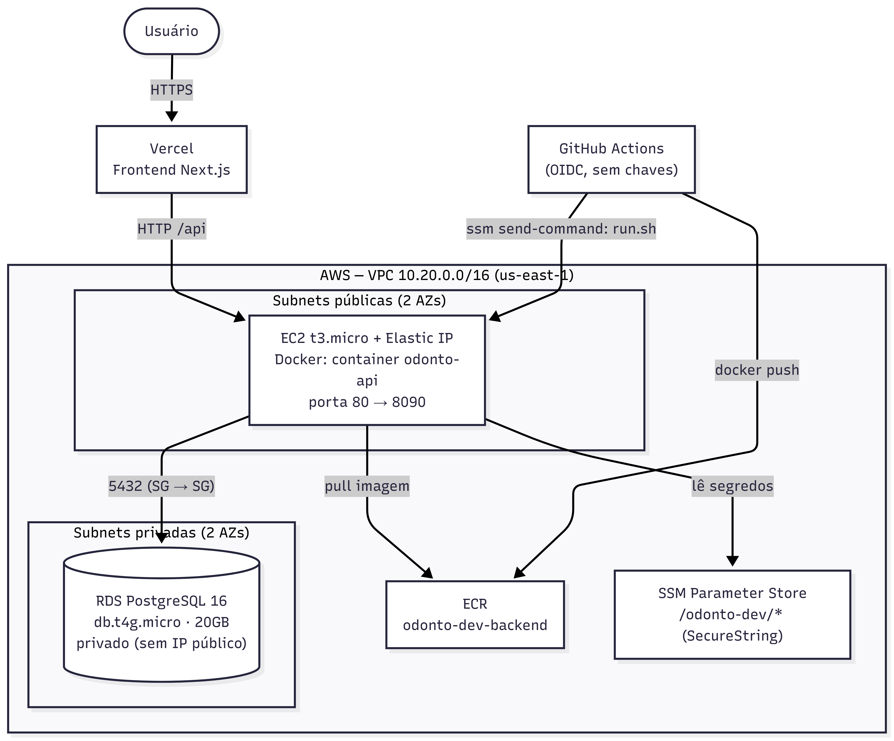

# Infraestrutura — Arquitetura AWS

> **Opcional / referência.** Esta é a implantação usada até aqui, mas a aplicação **não depende
> dela**. Para rodar local ou self-hosted (sem AWS), veja
> [Formas de executar e implantar](../README.md#formas-de-executar-e-implantar). Esta seção
> serve para quem for **herdar, recriar ou entender** o ambiente de nuvem atual.

Provisionada com **Terraform** (`backend/aws terraform deploy/odonto-infra/infra/terraform/`),
calibrada para rodar dentro do **AWS Free Tier**. Região: `us-east-1`. Prefixo dos recursos:
`odonto-dev`.

## Topologia

📷 Clique para ver a imagem

## Recursos provisionados

| Recurso              | Detalhe                                                                 |
|----------------------|------------------------------------------------------------------------|
| **VPC**              | `10.20.0.0/16`; 2 subnets públicas + 2 privadas em 2 AZs; sem NAT Gateway. |
| **EC2**              | t3.micro, Amazon Linux 2023, IMDSv2 obrigatório, CPU credits `standard`, swap 2GB. |
| **Elastic IP**       | IP fixo associado à EC2 (frontend aponta para ele).                     |
| **RDS**              | PostgreSQL 16, db.t4g.micro, 20GB gp3 fixo, criptografado, Single-AZ, `publicly_accessible = false`. |
| **ECR**              | `odonto-dev-backend`, lifecycle mantém ~2 tags.                         |
| **SSM Parameter Store** | Segredos e config em `/odonto-dev/*` (SecureString p/ senhas/JWT) — gratuito. |
| **IAM**              | Role da EC2 (ECR read + SSM Param + SSM managed) e role OIDC do GitHub Actions. |
| **Security Groups**  | EC2: 80/443 público (+ SSH só se `ssh_allowed_cidrs`); RDS: 5432 só do SG da EC2. |

## Acesso e segurança de rede

- **RDS não é acessível pela internet.** Só a EC2 (mesmo SG) fala 5432 com ele. Acesso externo
  para depuração é feito por **port forwarding via SSM** (ver [runbook](runbook.md#acessar-o-rds)).
- **Sem SSH por padrão.** Operação via **SSM Session Manager** (não exige porta 22 aberta nem
  chave). Habilite SSH só definindo `ssh_allowed_cidrs` no `terraform.tfvars`.
- **IMDSv2 obrigatório** na EC2.
- **Segredos** ficam no SSM Parameter Store (SecureString, KMS `alias/aws/ssm`) — escolhido em
  vez do Secrets Manager por ser gratuito.

## Adaptações para t3.micro (1 GB RAM)

O `user_data.sh` aplica três proteções para o Spring Boot caber:

1. **Swap de 2 GB** (`/swapfile`, `vm.swappiness=10`).
2. **Heap da JVM limitada**: `JAVA_TOOL_OPTIONS=-Xmx512m -Xss512k -XX:MaxMetaspaceSize=128m`.
3. **Limite de memória do container**: `--memory=768m --memory-swap=1536m`.

Startup é mais lento (~30–60s), mas estável.

## Parâmetros SSM (`/odonto-dev/*`)

| Parâmetro                      | Tipo         | Conteúdo                          |
|--------------------------------|--------------|-----------------------------------|
| `/odonto-dev/db/url`           | String       | JDBC URL do RDS                   |
| `/odonto-dev/db/username`      | String       | Usuário do banco (`odonto`)       |
| `/odonto-dev/db/password`      | SecureString | Senha master do RDS (gerada)      |
| `/odonto-dev/jwt/secret`       | SecureString | JWT secret (gerado)               |
| `/odonto-dev/mail/username`    | String       | Remetente SMTP                    |
| `/odonto-dev/mail/password`    | SecureString | App Password do Gmail             |

## Custos

Dentro do Free Tier (12 meses): **~US$ 0/mês**. Depois: **~US$ 25–30/mês** (RDS + EC2 + EIP).
Cuidados: não habilitar Multi-AZ, não escalar storage do RDS, manter **uma** EC2 24/7.

## Migração para produção

No `terraform.tfvars`: `environment = "prod"`, instâncias maiores (`t3.small` /
`db.t4g.small`), `db_multi_az = true`, `db_deletion_protection = true`, e considerar
ALB + ACM para HTTPS.

Próximo: [deploy e CI/CD](deploy-ci-cd.md).
