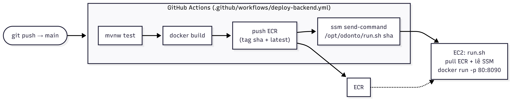

# Infraestrutura — Deploy e CI/CD

> **Opcional / referência.** Descreve o deploy automatizado em AWS usado até aqui. Não é
> obrigatório — a aplicação pode ser executada localmente ou self-hosted (ver
> [Formas de executar e implantar](../README.md#formas-de-executar-e-implantar)). Use esta
> página se for **reaproveitar ou reconstruir** o pipeline.

## Visão geral do deploy



Autenticação na AWS via **OIDC** (sem chaves estáticas no GitHub). O deploy é disparado por
**SSM Run Command** (não por SSH).

## Provisionar a infra (primeira vez)

Pré-requisitos: AWS CLI autenticada com permissão para criar os recursos, Terraform `>= 1.6`.

```bash
cd "backend/aws terraform deploy/odonto-infra/infra/terraform"
cp terraform.tfvars.example terraform.tfvars
# Edite: github_repository, frontend_origin, mail_username, mail_password
terraform init
terraform plan
terraform apply
```

Anote os **outputs** principais:

| Output                    | Uso                                                            |
|---------------------------|---------------------------------------------------------------|
| `ec2_public_ip`           | IP público da EC2 (frontend aponta para `http://<ip>/api`).    |
| `ec2_instance_id`         | Secret `EC2_INSTANCE_ID` do GitHub + acesso via SSM.          |
| `ecr_repository_url`      | Destino do `docker push`.                                      |
| `github_actions_role_arn` | Secret `AWS_ROLE_TO_ASSUME` do GitHub.                         |
| `rds_endpoint`            | Endpoint do RDS (acesso via túnel SSM).                        |
| `backend_url`             | URL pública do backend para o frontend.                        |

> Na primeira execução a EC2 sobe e tenta puxar a imagem `latest` do ECR; como o CI ainda não
> rodou, esse pull falha — é **esperado**. O systemd deixa o serviço pronto para o 1º deploy.

## Configurar o CI no repositório do backend

1. Copie `infra/github/deploy-backend.yml` para `.github/workflows/deploy-backend.yml` no repo
   do backend.
2. Em *Settings → Secrets and variables → Actions*, crie:

   | Secret | Valor |
   |---|---|
   | `AWS_ROLE_TO_ASSUME` | output `github_actions_role_arn` |
   | `EC2_INSTANCE_ID`    | output `ec2_instance_id` |

3. Confira no workflow: `AWS_REGION` (`us-east-1`) e `ECR_REPOSITORY` (`odonto-dev-backend`).

## O que o pipeline faz (`deploy-backend.yml`)

1. `actions/checkout` + `setup-java@21` (cache Maven).
2. `./mvnw -B test` (remova a etapa se quiser pular testes).
3. Assume a role AWS via OIDC; login no ECR.
4. `docker build` e push com duas tags: `github.sha` e `latest`.
5. `aws ssm send-command` rodando `/opt/odonto/run.sh <sha>` na EC2; aguarda e reporta o status.

## O que a EC2 faz no boot (`user_data.sh`)

1. Cria swap, instala Docker + awscli + jq, habilita o serviço.
2. Gera `/opt/odonto/run.sh` que: faz login no ECR, **lê os segredos do SSM**
   (`/odonto-dev/*`), faz `docker pull` e sobe o container `odonto-api`
   (`-p 80:8090`, limites de memória, `--restart unless-stopped`, log via journald).
3. Registra o serviço **systemd** `odonto-api.service` (sobe no boot).

## Deploy do frontend (Vercel) — opcional

1. Conecte o repositório do frontend na Vercel (auto-deploy por push).
2. Em *Settings → Environment Variables*: `NEXT_PUBLIC_API_URL = http://<EIP-da-EC2>/api`.
3. Redeploy.

> **Mixed content:** frontend HTTPS chamando backend HTTP pode ser bloqueado pelo browser. Para
> produção, coloque TLS na frente do backend (Caddy/Nginx + Let's Encrypt) ou um domínio com
> certificado.

## Destruir a infra

```bash
terraform destroy   # db_deletion_protection=false em dev, roda direto
```

Operação do dia a dia: ver [runbook](runbook.md).